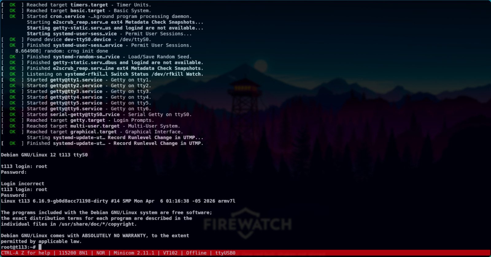
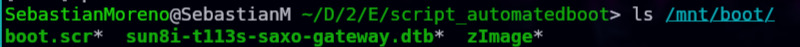

## Debian booting

By default, Debian does not boot automatically when powering the board. Additional configuration is required to properly load the system.

Initially, the kernel and the Device Tree Blob (DTB) must be manually loaded from the SD card into memory. To do this, use the following commands:

```bash
fatload mmc 0:1 ${kernel_addr_r} zImage
fatload mmc 0:1 ${fdt_addr_r} sun8i-t113s-saxo-gateway.dtb
```

However, loading the kernel alone is not sufficient. It is also necessary to **define the kernel boot arguments** so that the system knows where the root filesystem is located and how to initialize the console.

To configure these parameters, use the following command:
```bash
setenv bootargs console=ttyS0,115200 root=/dev/mmcblk0p2 rootwait rw
```

These arguments specify the serial console interface and indicate that the root filesystem is located on the second partition of the SD card.

Finally, once the kernel, DTB, and boot arguments are properly set, the kernel can be executed with:
```bash
bootz ${kernel_addr_r} - ${fdt_addr_r}
```

At this point, the Linux kernel begins execution, mounts the root filesystem, and starts the Debian user space. If everything is correctly configured, the system will present a login prompt through the serial console. 



## Script for automated booting to Debian

To enable automatic booting, a `.scr` script must be added to the boot partition (FAT), where the kernel and Device Tree files are located. This script contains the commands that U-Boot will execute at startup.

Since U-Boot does not interpret plain text scripts directly, it is first necessary to create a `.cmd` file containing the desired commands. This file is later compiled into a `.scr` image that U-Boot can execute.

To create the command script, use the following command:

```bash
nano boot.cmd 
```

Then, define the boot sequence inside the file as follows:

```bash
setenv bootargs console=ttyS0,115200 root=/dev/mmcblk0p2 rootwait rw

fatload mmc 0:1 ${kernel_addr_r} zImage
fatload mmc 0:1 ${fdt_addr_r} sun8i-t113s-saxo-gateway.dtb

bootz ${kernel_addr_r} - ${fdt_addr_r}
```

These commands configure the kernel boot arguments, load the kernel image and Device Tree Blob into memory, and finally execute the kernel.

Once the `.cmd` file is defined, it must be converted into a U-Boot script image using the following command:

```bash
mkimage -C none -A arm -T script -d boot.cmd boot.scr
```

This generates the `boot.scr` file, which is the executable script recognized by U-Boot.

Finally, the generated `boot.scr` file must be copied into the boot partition of the SD card, alongside the kernel (`zImage`) and the Device Tree file (`.dtb`)_
```bash
sudo cp boot.scr /mnt/boot/
sync
sudo umount /mnt/boot
```

During startup, U-Boot will detect and execute this script automatically, allowing the system to boot into Debian without manual intervention.

