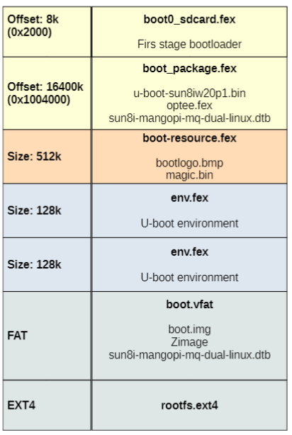
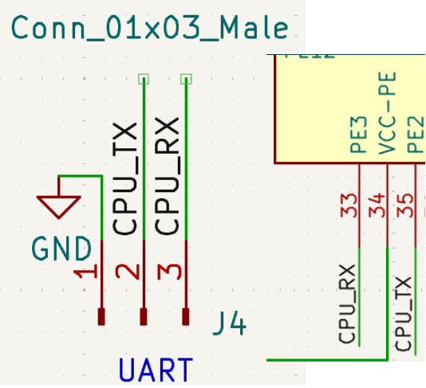
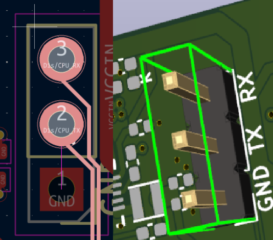
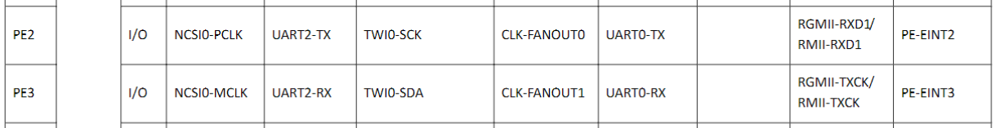

---

It is necessary to get the submodules that the based on repository asks, but it does not work if some changes are not made. 

First, the SD card must be cleaned and formatted in order to correctly deploy the embedded system image. The following image illustrates the required SD logic :





In version 1.0, the initial step is to compile **U-Boot** and create the necessary SD card partitions. The steps for preparing the SD card and fixing U-boot are described below. 


---
## U-boot fix

Within the base Debian repository, a script named **build_u-boot.sh** is provided, whose contents are shown below:

```
#!/bin/bash

SCRIPT_DIR="$(dirname "$(realpath "${BASH_SOURCE[0]}")")"

cd $SCRIPT_DIR

cp u-boot-patch-v2025.07/t113s_saxo_defconfig u-boot/configs
cp u-boot-patch-v2025.07/sun8i-t113s-saxo.dts         u-boot/arch/arm/dts
cp u-boot-patch-v2025.07/sunxi-d1s-t113s-saxo.dtsi    u-boot/arch/arm/dts
cp u-boot-patch-v2025.07/sunxi-d1s-t113.dtsi          u-boot/arch/riscv/dts

cd u-boot

git checkout -f

patch -d . -p1 <  ../u-boot-patch-v2025.07/0001-saxo-dtb.patch

make ARCH=arm CROSS_COMPILE=arm-linux-gnueabi- -j4 t113s_saxo_defconfig
make ARCH=arm CROSS_COMPILE=arm-linux-gnueabi- -j4

```

It can be observed that some files located in the U-Boot patch directory are copied into the root of the U-Boot source tree. Certain modifications must be made to these files. First, by reviewing the PCB hardware design, it can be seen that the **UART0 pins were configured for communication with the SoC**: 





Those specific Pins are related to UART0:



However, in the original configuration files, the UART interface is set to **UART3**. Therefore, it is necessary to modify the configuration to use **UART0** instead.

### 1) t113s_saxo_defconfig

The value of *CONFIG_CONS_INDEX* must be changed from *=4* to *=1* (UART3 to UART0).

### 2) sunxi-d1s-t113s-saxo.dtsi

The following code was added to declare **UART0** and disable **UART3**:

```
&uart3 {        
        pinctrl-names = "default";
        pinctrl-0 = <&uart3_pb_pins>;
        status = "disabled";
};

&uart0 {        
        pinctrl-names = "default";
        pinctrl-0 = <&uart0_pe2_pins>;
        status = "okay";
};
```

### 3) build_u-boot.sh

Move the **git checkout -f** command to the beginning of the `.sh` script. This command resets all files in the working directory to the state stored in the current Git commit.

It is also necessary to move the **cd u-boot** command before executing **git checkout -f**, since the reset must be performed inside the U-Boot repository. However, the **cd u-boot** command should remain later in the script as well, as it is required for the patch application and the compilation steps.

The final version of the script is shown below:

```
#!/bin/bash

SCRIPT_DIR="$(dirname "$(realpath "${BASH_SOURCE[0]}")")"

cd u-boot
git checkout -f

cd $SCRIPT_DIR

cp u-boot-patch-v2025.07/t113s_saxo_defconfig u-boot/configs
cp u-boot-patch-v2025.07/sun8i-t113s-saxo.dts         u-boot/arch/arm/dts
cp u-boot-patch-v2025.07/sunxi-d1s-t113s-saxo.dtsi    u-boot/arch/arm/dts
cp u-boot-patch-v2025.07/sunxi-d1s-t113.dtsi          u-boot/arch/riscv/dts

cd u-boot
patch -d . -p1 <  ../u-boot-patch-v2025.07/0001-saxo-dtb.patch

make ARCH=arm CROSS_COMPILE=arm-linux-gnueabi- -j4 t113s_saxo_defconfig
make ARCH=arm CROSS_COMPILE=arm-linux-gnueabi- -j4


```

---
## SD Preparation

### 1) SD formatting and partitioning

Using the Linux utility **fdisk**, it is possible to create, modify, and delete partitions on any storage device. In this case, the SD card is located at **/dev/sda**. Once the correct device path is known, the SD card can be prepared using the following commands:


```
sudo fdisk /dev/sda
d # Repeat until every partition has been deleted.
n # Add new partition
p # Type of partition (Primary)
1 # Partation number
35360 # First sector
36383 # Last sector
p # Check that the partition has been created and its size ies 512K
w # Write table to disk and exit
```

The exact location of the first and last sectors is determined by the memory space required to store the **U-Boot bootloader** on the SD card. The first sector is set to **35360** because the initial sectors of the SD card are reserved for the bootloader, boot configuration data, and other low-level system components required by the SoC during the boot process.

### 2) U-boot upload on SD card

The manufacturer of the **T113s SoC (Allwinner)** specifies that the first stage of **U-Boot** must be written to the storage device with an offset of **8 kB (0x2000)**. At this location, a valid binary containing the appropriate boot header must be present so that the SoC boot ROM can correctly load the bootloader.

To accomplish this, **U-Boot must first be compiled** in order to generate the corresponding binary image. Depending on the build configuration, the resulting binaries may include separate images for the **SPL (Secondary Program Loader)** and the full **U-Boot bootloader**, or a combined image containing both components.

In this particular case, the combined binary file u-boot-sunxi-with-spl.bin, which includes both the SPL and the full U-Boot bootloader, is written to the specified offset using the following command:

```
sudo dd if=u-boot-sunxi-with-spl.bin of=/dev/sda bs=1024 seek=8

# dd: low-level disk copy utility used to write raw data to a device

# if= : input file (the compiled U-Boot binary) Before partition sda1

# of= : output device (the SD card)

# bs=1024 : block size of 1024 bytes (1 KB)

# seek=8 : skip the first 8 blocks (8 KB) before writing

# Result: writes the bootloader starting at offset 8 KB (0x2000) on the SD card
```


### 3) 