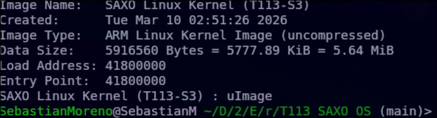

---
## General context of the Kernel Built

The Linux kernel is responsible for low-level communication with the hardware. In many case (especially in embedded systems) much of this process is already automated. The process of adapting the Linux kernel and the filesystem to a specific platform can generally be performed using two approaches:

- **Buildroot**
- **A system image assembled from individual components**

In many situations, a Buildroot configuration is already provided for a specific platform or development board. This is the case for the **Allwinner T113s**, where existing configurations can be used as a starting point for building a functional embedded Linux system. 

After building and installing the bootloader, the next step consists of compiling the Linux kernel adapted to the target hardware platform. The base repository relies on the official Linux kernel source tree. However, several modifications are required in order to support the custom SAXO development board based on the Allwinner T113-S3 processor. It uses the script *build_kernel.sh* to apply several specific modifications before compiling the kernel:

```

#!/bin/bash

SCRIPT_DIR="$(dirname "$(realpath "${BASH_SOURCE[0]}")")"

cd $SCRIPT_DIR

cp linux-patch-6.16.9/sun8i-t113s-saxo-gateway.dts linux/arch/arm/boot/dts/allwinner
cp linux-patch-6.16.9/sunxi-d1s-t113s-saxo.dtsi     linux/arch/arm/boot/dts/allwinner
cp linux-patch-6.16.9/config  linux/.config

cd linux

git checkout -f

patch -d . -p1 < ../linux-patch-6.16.9/0001-saxo-dtb-reference.patch

make ARCH=arm CROSS_COMPILE=arm-linux-gnueabi- menuconfig
make ARCH=arm CROSS_COMPILE=arm-linux-gnueabi- zImage dtbs modules -j4

cd $SCRIPT_DIR

LOAD_ADDR=0x41800000
ENTRY_ADDR=0x41800000

mkimage -A arm -O linux -T kernel -C none \
  -a $LOAD_ADDR -e $ENTRY_ADDR \
  -n "SAXO Linux Kernel (T113-S3)" \
  -d ./linux/arch/arm/boot/zImage uImage
echo "SAXO Linux Kernel (T113-S3)" : uImage

```


To achieve this, specific Device Tree files describing the hardware configuration of the board are copied into the Linux source tree. In addition, a predefined kernel configuration file is provided to enable the required drivers and subsystems.

A patch is also applied to the kernel source code in order to register the new Device Tree within the build system. Once these modifications are in place, the kernel, device tree blobs, and kernel modules are compiled using a cross-compiler targeting the ARM architecture. Finally, the resulting kernel image is converted into a U-Boot compatible format using the `mkimage` tool. This generates a `uImage` file that can be loaded by the bootloader during the system startup process.

However, since some changes were previously made to U-Boot, it is necessary to verify that the patch still applies correctly. In other words, each file modified by the patch must be reviewed to ensure that the changes are still valid. Additionally, the build script should be checked to confirm that its execution flow remains logical and consistent with the current modifications.

---

## Checking Linux DTS

### 1) sunxi-d1s-t113s-saxo.dtsi

The same modifications performed in the U-Boot configuration must be applied here as well. In general, this consists of enabling **UART0** and disabling **UART3** in order to match the hardware configuration of the board:

```
&uart3 {        
        pinctrl-names = "default";
        pinctrl-0 = <&uart3_pb_pins>;
        status = "disabled";
};

&uart0 {        
        pinctrl-names = "default";
        pinctrl-0 = <&uart0_pe2_pins>;
        status = "okay";
};
```

Additionally, the following code section must be modified to specify which serial port will be used as the CPU's RX–TX interface:

```
	chosen {
		stdout-path = "serial3:115200n8";
	};
	
	# to
	
	chosen {
		stdout-path = "serial0:115200n8";
	};
```

### 2) Kernel configuration file (.config)

The Linux kernel build system uses a configuration file named `.config` located at the root of the kernel source tree. This file defines all the options used during the compilation process, including enabled drivers, supported subsystems, architecture settings, and hardware-specific features.

Each configuration option follows the format:

```
CONFIG_OPTION=value
```

These options determine which components are compiled directly into the kernel, compiled as loadable modules, or excluded from the build. This ensures that the kernel is compiled with the correct configuration required for the target hardware platform (Allwinner T113-S3). Using a predefined configuration avoids the need to manually enable the required drivers and features through the `menuconfig` interface.

Once the `.config` file is present, the Linux build system automatically uses it to determine which components must be compiled when executing the `make` command.

During the kernel build process, the compilation may fail in the `drivers/base/firmware_loader` stage.  
This happens because the configuration file includes a reference to an external firmware file that is not present in the build environment.  
  
Originally, the configuration contained the following line:

```
CONFIG_EXTRA_FIRMWARE="rtlwifi/rtl8723bu_nic.bin"
```


This option instructs the kernel build system to embed the specified firmware into the kernel image. However, since this firmware file is not available in the expected firmware directory (`/lib/firmware`), the build process fails.

To avoid this issue, the firmware reference must be removed by modifying the configuration as follows:

```
CONFIG_EXTRA_FIRMWARE=""
```

### 3) Add `sunxi-d1s-t113.dtsi` to the Linux patch

If the kernel is built without additional modifications, the compilation process will fail because the configuration referencing the pin labels for **UART0** cannot be resolved.

Although there are several possible ways to fix this issue, the chosen approach was to simply include the required configuration file inside the `linux-patch` directory and modify the build script so that this file is also copied into the Linux source tree before compilation.

The original file containing this configuration can be found in **linux/arch/riscv/boot/dts/allwinner**.  This file is copied into the patch directory and the following configuration is added within the SoC description:


```
soc {
/omit-if-no-ref/
			uart0_pe2_pins: uart0-pe2-pins {
				pins = "PE2", "PE3";
				function = "uart0";
			};
			
	}
```


This definition provides the pin control configuration required for **UART0**, allowing the kernel to correctly resolve the pin label referenced by the Device Tree.

Once this modification is implemented, the `build_kernel.sh` script must be updated so that the modified file is also copied into the corresponding directory inside the Linux source tree before the kernel build process begins.

### 3) Update build_kernel.sh

Several additional modifications were introduced in the script to improve the reliability and reproducibility of the build process.

First, the option `set -e` was added at the beginning of the script. This instructs the shell to immediately stop the execution if any command returns a non–zero exit status. In this way, the build process does not continue after a failure, preventing the generation of incomplete or inconsistent outputs.

Additionally, the commands `git reset --hard` and `git clean -fd` are executed inside the `linux` directory before copying any modified files. These commands ensure that the Linux source tree is completely restored to the exact state of the current Git commit.

The command `git reset --hard` discards all local modifications to tracked files, while `git clean -fd` removes any untracked files or directories that may have been generated during previous builds. Together, these commands guarantee that every execution of the script starts from a fully clean source tree.

Another modification consists of copying an additional file, `sunxi-d1s-t113.dtsi`, into the directory `linux/arch/riscv/boot/dts/allwinner`. This file contains the declaration of the pin configuration required for the UART0 interface. Without this definition, the device tree compilation fails because the corresponding pin labels cannot be resolved during the build process.

Finally, the patch application command was commented out. Originally, the script attempted to apply the patch `0001-saxo-dtb-reference.patch` using the `patch` command. However, the changes introduced by this patch were already incorporated directly into the copied files. If the patch were applied again, the build system would detect it as a reversed or previously applied patch, which results in conflicts during the compilation process. For this reason, the patch step was disabled to avoid redundant modifications and to ensure a clean and deterministic build workflow.

```
#!/bin/bash

set -e # Se detendra si un comando no sirve

SCRIPT_DIR="$(dirname "$(realpath "${BASH_SOURCE[0]}")")"

cd linux
git reset --hard
git clean -fd

cd $SCRIPT_DIR

cp linux-patch-6.16.9/sun8i-t113s-saxo-gateway.dts linux/arch/arm/boot/dts/allwinner
cp linux-patch-6.16.9/sunxi-d1s-t113s-saxo.dtsi     linux/arch/arm/boot/dts/allwinner
cp linux-patch-6.16.9/sunxi-d1s-t113.dtsi     linux/arch/riscv/boot/dts/allwinner # Linea nueva añadida para los pines
cp linux-patch-6.16.9/config  linux/.config

cd linux

# N ignore los parches ya aplicados
# patch -N -d . -p1 < ../linux-patch-6.16.9/0001-saxo-dtb-reference.patch

make ARCH=arm CROSS_COMPILE=arm-linux-gnueabi- olddefconfig
make ARCH=arm CROSS_COMPILE=arm-linux-gnueabi- zImage dtbs modules -j4

cd $SCRIPT_DIR

LOAD_ADDR=0x41800000
ENTRY_ADDR=0x41800000

mkimage -A arm -O linux -T kernel -C none \
  -a $LOAD_ADDR -e $ENTRY_ADDR \
  -n "SAXO Linux Kernel (T113-S3)" \
  -d ./linux/arch/arm/boot/zImage uImage
echo "SAXO Linux Kernel (T113-S3)" : uImage
```

### 4) Kernel build

The kernel build script is then executed to verify that the compilation process completes successfully. This step allows checking that the applied modifications, patches, and configuration files are consistent and do not introduce compilation errors:



The build process generates the Linux kernel image, the corresponding Device Tree binaries (DTBs), and the required kernel modules for the target platform.

Specifically, the compilation produces the compressed kernel image `zImage`, which is the binary executed by the bootloader during the system startup. In addition, the Device Tree sources (`.dts` and `.dtsi`) are compiled into Device Tree Binary files (`.dtb`). These files describe the hardware configuration of the board, including peripherals, pin assignments, clocks, and memory layout, allowing the Linux kernel to correctly initialize and interact with the system hardware.

The process also builds the loadable kernel modules specified in the configuration file. These modules provide support for optional drivers and subsystems that can be dynamically loaded by the operating system after boot.

Finally, the generated `zImage` is wrapped using the `mkimage` tool to create a `uImage`, which includes the required header metadata for U-Boot. This header specifies parameters such as the architecture, load address, entry point, compression type, and image name, enabling the bootloader to correctly load and execute the kernel during the boot sequence.

